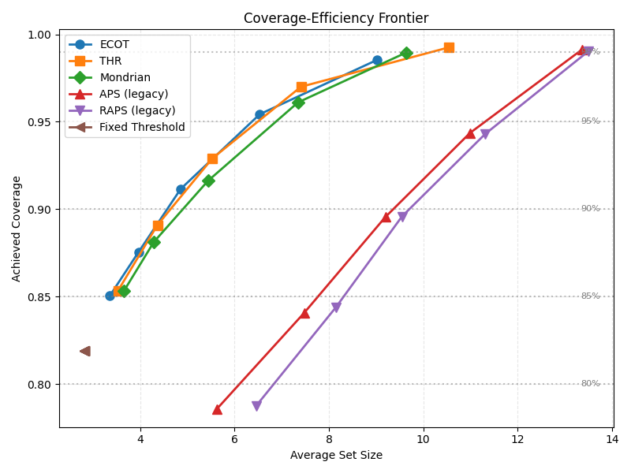
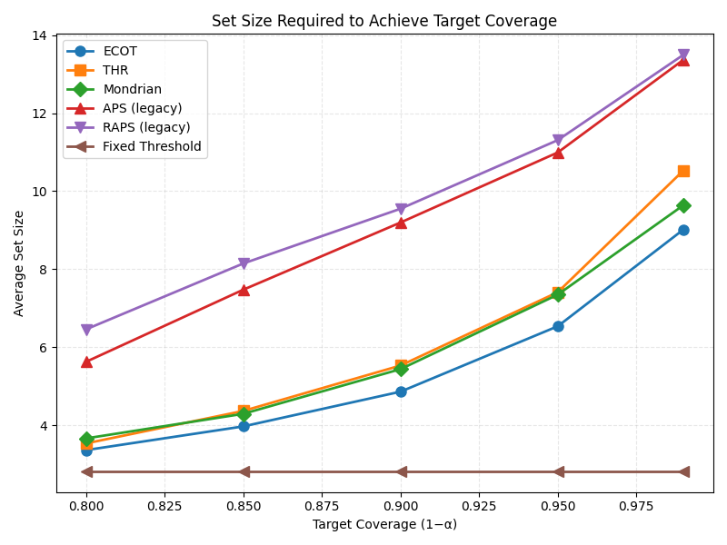

## 📌 Overview

Standard multi-label classifiers output a fixed set of labels using a threshold (e.g., 0.5). This ignores model uncertainty and offers no control over false positives / false negatives.  
This repository explores **conformal prediction** methods that turn any trained classifier into a **set predictor** with a user‑specified marginal coverage guarantee.

We experiment on the **CheXpert** dataset, comparing a fixed‑threshold baseline against several state‑of‑the‑art conformal approaches:

| Method                                           | Description                                                        |
| ------------------------------------------------ | ------------------------------------------------------------------ |
| **Fixed Threshold**                              | Classical baseline                                                 |
| **THR** (Threshold)                              | Conformal calibration of a single global threshold                 |
| **APS** (Adaptive Prediction Sets)               | Adaptive threshold per example using sorted probabilities          |
| **RAPS** (Regularized APS)                       | APS with a penalty on set size for tighter sets                    |
| **Mondrian**                                     | Class‑conditional conformal prediction for fairness across classes |
| **ECOT** (Entropy‑Constrained Optimal Transport) | Optimal transport‑based conformal predictor with size constraints  |

> **Note (baseline thresholds):** The Fixed Threshold baseline uses class-specific thresholds chosen **heuristically** via exploratory inspection on the held-out calibration/validation pool (not optimized via a formal objective).  
> These thresholds are included to provide a stronger non-conformal reference point than a single global 0.5 cutoff.

=======
All methods are evaluated with respect to:

- ✅ **Coverage** – empirical marginal / class‑conditional coverage
- 📏 **Set Size** – average number of predicted labels
- 📊 **Class‑wise Behaviour** – per‑class coverage, set composition, and failure modes

=======

## 📊 Experimental Results

**Dataset split:**  
Calibration set: `2,803` samples | Test set: `2,804` samples  
**Target error rate:** `α = 10%` → desired marginal coverage ≥ **90%**

---

### 🏆 Overall Performance (α = 0.1)

=======
| Method | Coverage | Avg. Size | F1↑ | Coverage ≥ 90%? |
|----------------------|----------|-----------|--------|:---------------:|
| Fixed Threshold | 0.8188 | **2.82** | 0.4411 | ❌ |
| **ECOT** | **0.9116** | 4.86 | 0.2755 | ✅ |
| THR | 0.9290 | 5.53 | 0.2573 | ✅ |
| Mondrian | 0.9162 | 5.44 | 0.2431 | ✅ |
| APS (legacy) | 0.8955 | 9.20 | 0.1626 | ❌ |
| RAPS (legacy) | 0.8959 | 9.55 | 0.1607 | ❌ |

**Key observations:**

- **Baseline (Fixed Threshold)** fails to meet the 90% coverage guarantee, despite having the smallest set size – it is overconfident and unreliable.
- **THR, ECOT, and Mondrian** all provide valid distribution-free coverage (≥90%) with conformal calibration.
- **ECOT** achieves the best trade-off: it is **the only valid method with an average set size below 5**, producing significantly tighter prediction sets than THR or Mondrian.
- The legacy implementations of **APS and RAPS** both undercover (≈89.6%) and yield extremely large sets (≥9.2), highlighting the need for proper regularization when applying conformal prediction to multi-label problems.
- F1 is reported for completeness, but **set predictors trade point-wise precision for guaranteed coverage** – their primary metrics are coverage and set size.

### 📈 Overall Metrics Across α Levels

--- ECOT ---
| α | Target Cov | Achieved Cov | Avg Set Size | F1 |
|------|------------|--------------|--------------|-------|
| 0.01 | 99.00% | 0.9854 | 9.02 | 0.1362 |
| 0.05 | 95.00% | 0.9544 | 6.54 | 0.2040 |
| 0.10 | 90.00% | 0.9116 | 4.86 | 0.2755 |
| 0.15 | 85.00% | 0.8755 | 3.97 | 0.3217 |
| 0.20 | 80.00% | 0.8506 | 3.36 | 0.3637 |

--- THR ---
| α | Target Cov | Achieved Cov | Avg Set Size | F1 |
|------|------------|--------------|--------------|-------|
| 0.01 | 99.00% | 0.9925 | 10.53 | 0.1135 |
| 0.05 | 95.00% | 0.9700 | 7.41 | 0.1905 |
| 0.10 | 90.00% | 0.9290 | 5.53 | 0.2573 |
| 0.15 | 85.00% | 0.8909 | 4.37 | 0.3156 |
| 0.20 | 80.00% | 0.8534 | 3.53 | 0.3721 |

--- Mondrian ---
| α | Target Cov | Achieved Cov | Avg Set Size | F1 |
|------|------------|--------------|--------------|-------|
| 0.01 | 99.00% | 0.9897 | 9.64 | 0.1197 |
| 0.05 | 95.00% | 0.9611 | 7.35 | 0.1748 |
| 0.10 | 90.00% | 0.9162 | 5.44 | 0.2431 |
| 0.15 | 85.00% | 0.8812 | 4.29 | 0.3080 |
| 0.20 | 80.00% | 0.8534 | 3.66 | 0.3431 |

--- APS (legacy) ---
| α | Target Cov | Achieved Cov | Avg Set Size | F1 |
|------|------------|--------------|--------------|-------|
| 0.01 | 99.00% | 0.9914 | 13.37 | 0.1049 |
| 0.05 | 95.00% | 0.9437 | 10.99 | 0.1397 |
| 0.10 | 90.00% | 0.8955 | 9.20 | 0.1626 |
| 0.15 | 85.00% | 0.8406 | 7.47 | 0.1803 |
| 0.20 | 80.00% | 0.7857 | 5.63 | 0.1952 |

--- RAPS (legacy) ---
| α | Target Cov | Achieved Cov | Avg Set Size | F1 |
|------|------------|--------------|--------------|-------|
| 0.01 | 99.00% | 0.9904 | 13.50 | 0.1030 |
| 0.05 | 95.00% | 0.9429 | 11.31 | 0.1366 |
| 0.10 | 90.00% | 0.8959 | 9.55 | 0.1607 |
| 0.15 | 85.00% | 0.8438 | 8.15 | 0.1767 |
| 0.20 | 80.00% | 0.7874 | 6.46 | 0.1930 |

--- Fixed Threshold ---
| α | Target Cov | Achieved Cov | Avg Set Size | F1 |
|------|------------|--------------|--------------|-------|
| 0.01 | 99.00% | 0.8188 | 2.82 | 0.4411 |
| 0.05 | 95.00% | 0.8188 | 2.82 | 0.4411 |
| 0.10 | 90.00% | 0.8188 | 2.82 | 0.4411 |
| 0.15 | 85.00% | 0.8188 | 2.82 | 0.4411 |
| 0.20 | 80.00% | 0.8188 | 2.82 | 0.4411 |

---

### 📉 Multi-α Behaviour Visualizations

#### Figure 1: Coverage and Average Set Size vs α

**Description:**  
Left: Empirical coverage of each method across different α levels, compared against the ideal target coverage line (1 − α).  
Right: Average prediction set size as a function of α.  
**ECOT**, **THR**, and **Mondrian** stay close to the target coverage while producing substantially smaller sets than the legacy APS/RAPS implementations. The Fixed Threshold baseline remains almost constant (as expected) but fails to meet the coverage guarantee.

#### Figure 2: F1 Score and Efficiency–Coverage Trade-off

**Description:**  
Left: F1 score improves as α increases (sets become smaller and more precise).  
Right: Efficiency (1 / Avg. Set Size) versus achieved coverage. This plot clearly shows the superior trade-off of **ECOT**, **THR**, and **Mondrian** compared to the large and inefficient sets of APS/RAPS. Fixed Threshold has high efficiency but insufficient coverage.

---

### 🔬 Class‑Conditional Coverage Analysis

Coverage per pathology across all methods.  
**Bold** numbers indicate where the 90% target is met for that specific class.

| Class              | Test Positives | Prevalence (%) | Fixed      | **ECOT**   | THR        | Mondrian   | APS        | RAPS       |
| ------------------ | -------------- | -------------- | ---------- | ---------- | ---------- | ---------- | ---------- | ---------- |
| Atelectasis        | 330            | 11.77          | 0.7667     | 0.8667     | 0.8970     | 0.8727     | 0.8030     | 0.8000     |
| Cardiomegaly       | 73             | 2.60           | 0.8630     | **0.9178** | 0.8904     | **0.9178** | 0.8630     | 0.8630     |
| Effusion           | 328            | 11.70          | 0.7774     | 0.8902     | **0.9116** | 0.8902     | 0.8476     | 0.8476     |
| Infiltration       | 490            | 17.48          | 0.5980     | 0.8735     | 0.8959     | 0.8755     | 0.8265     | 0.8204     |
| Mass               | 154            | 5.49           | 0.7727     | 0.8182     | 0.8831     | 0.8182     | 0.7727     | 0.7597     |
| Nodule             | 140            | 4.99           | 0.7500     | **0.9286** | **0.9071** | **0.9429** | 0.8071     | 0.7857     |
| Pneumonia          | 31             | 1.11           | 0.7419     | **0.9032** | **0.9032** | **1.0000** | 0.7742     | 0.7419     |
| Pneumothorax       | 138            | 4.92           | 0.7101     | 0.7899     | 0.8696     | 0.7899     | 0.8841     | 0.8986     |
| Consolidation      | 127            | 4.53           | 0.6929     | 0.8740     | 0.8740     | 0.8740     | 0.7874     | 0.7953     |
| Edema              | 52             | 1.85           | 0.8654     | 0.8654     | **0.9423** | 0.8846     | **0.9038** | **0.9038** |
| Emphysema          | 75             | 2.67           | **0.9333** | **0.9600** | **0.9600** | **0.9600** | **0.9600** | **0.9467** |
| Fibrosis           | 37             | 1.32           | 0.5946     | 0.7297     | **0.9730** | 0.7838     | 0.8378     | 0.8108     |
| Pleural Thickening | 89             | 3.17           | 0.7079     | **0.9101** | 0.8876     | **0.9213** | 0.8202     | 0.8090     |
| Hernia             | 7              | 0.25           | 0.1429     | 0.4286     | 0.7143     | 0.5714     | 0.8571     | 0.8571     |

### 🚨 Most Challenging Classes (Worst-Case Coverage)

| Method          | Worst Class | Coverage |
| --------------- | ----------- | -------- |
| Fixed Threshold | **Hernia**  | 0.1429   |
| ECOT            | **Hernia**  | 0.4286   |
| THR             | **Hernia**  | 0.7143   |
| Mondrian        | **Hernia**  | 0.5714   |
| APS (legacy)    | Mass        | 0.7727   |
| RAPS (legacy)   | Pneumonia   | 0.7419   |

**Takeaway:**  
Hernia – an extremely rare finding in CheXpert – remains the Achilles' heel for all methods. While conformal predictors improve its coverage dramatically (from **14% → 71%** with THR), none fully meet the 90% target for this class.  
Mondrian’s per-class guarantee also suffers on Hernia, suggesting that further class‑adaptive strategies or data augmentation are needed for long‑tail pathologies.

---
